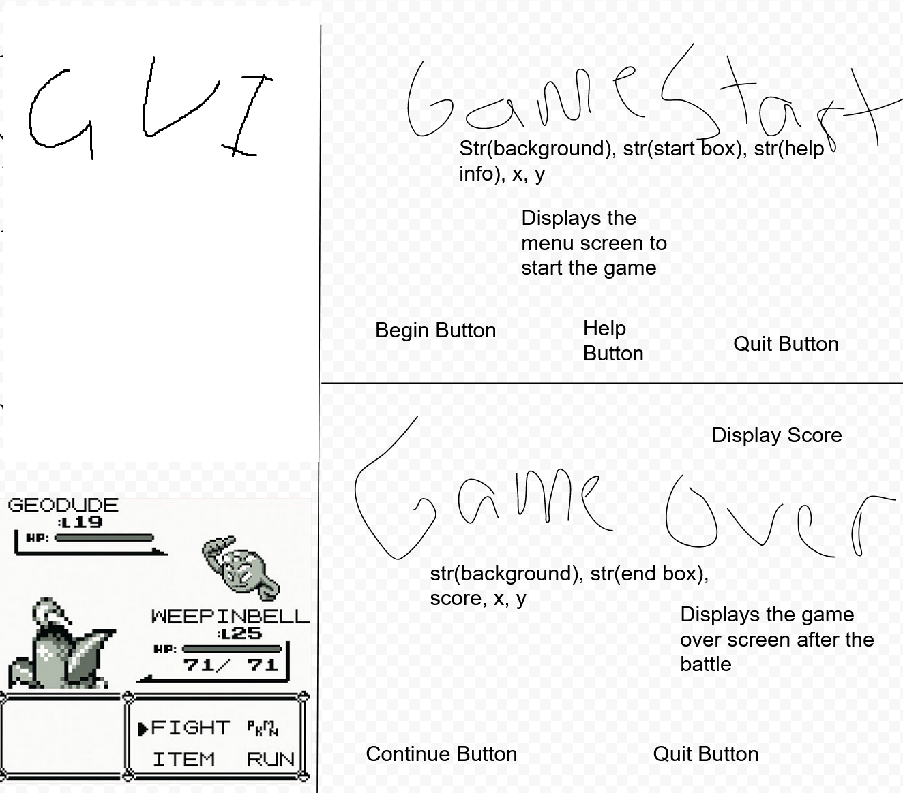
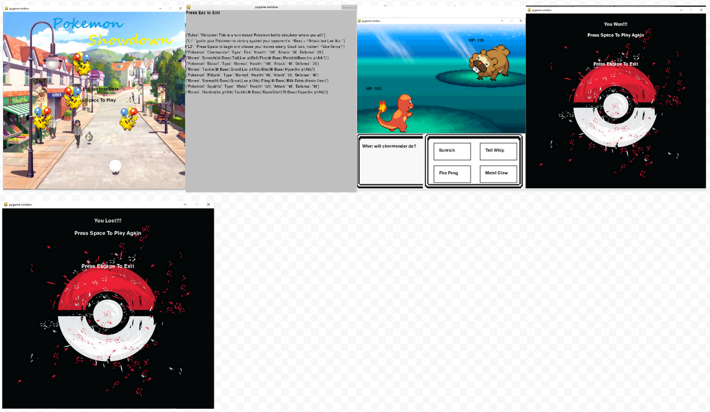
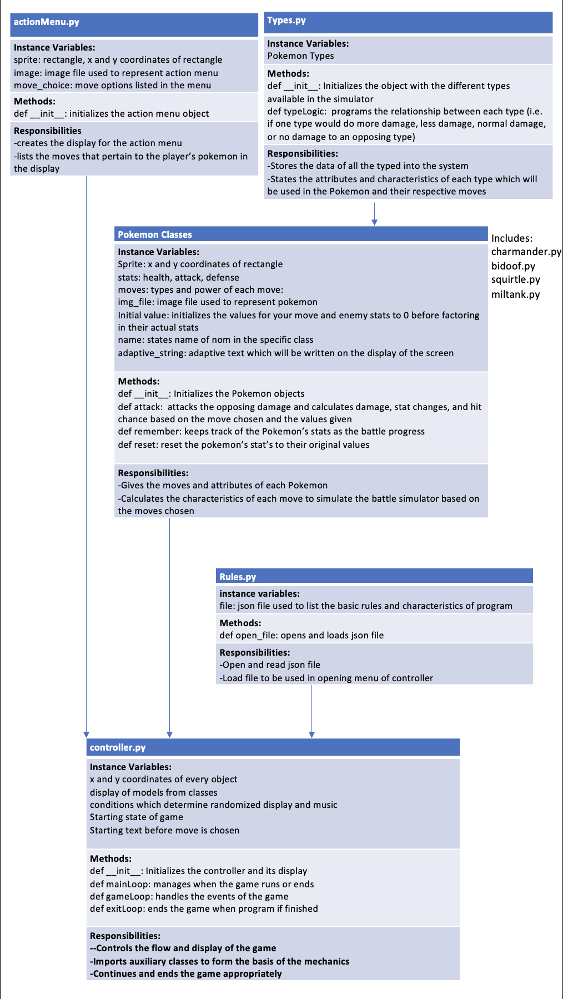

# Pokemon ShowDown

#### Anthony Albanese Kyle Enriquez 

## Game Description
Pokemon Battle simulator.
User has 4 moves that they can attack the enemy with, and after each choice the enemy attacks back.
There are 2 pokemon on the user and enemy side!
***    

## User Interface Design
Proposed:
* 
Current:
* 
***        

## Program Design

* Class Interface Design
    *  A simple drawing that shows the class relationships in code.
        * 
	
* Classes
    * In this code, we simulated a turn-based battle simulator which runs based on user input on the GUI
In order to do so, we created various Pokemon classes which determine the attributes of the Pokemon and their respective moves
To correspond to this, a types class was added to list the types available and their respective relationships with one another
For display, an action menu was added to display the moves of each respective Pokemon on the player’s team
Furthermore, a rules class was added to read and load a json file, which portrays in text the instructions and attributes of the game
Finally, all of the aforementioned classes are imported to the controller, which dictates the display and flow of the game

### Software Lead - Anthony Albanese

Organized team, maintained schedule, and tested code, helped design GUI, found sprite/images. Reviewed/Edited every files often!

### Front End Specialist - Anthony Albanese

Made controller, created class for bidoof, squirtle and miltank, created type system class, organized/found music, sprites and backgrounds. 
Features: 
GUI, turn based combat, math/balancing values for fighting, type system (not implemented but functional), action menu, enemy pokemon, switching, text string GUI, multiple screens, music!

### Back End Specialist - Kyle Enriquez 

The back end specialist created the Pokemon classes, including their stats, moves, and calculation of damage, added action menu class which adds to display and corresponds to respective moves based on the Pokemon being used, incorporated json file with the rules and attributes of the game and a class to read and load file for use

